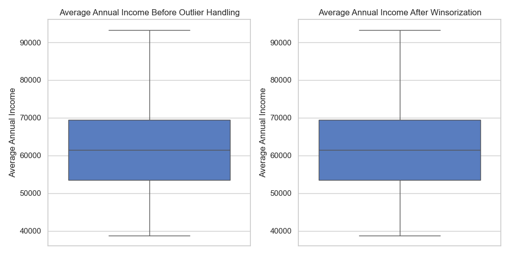
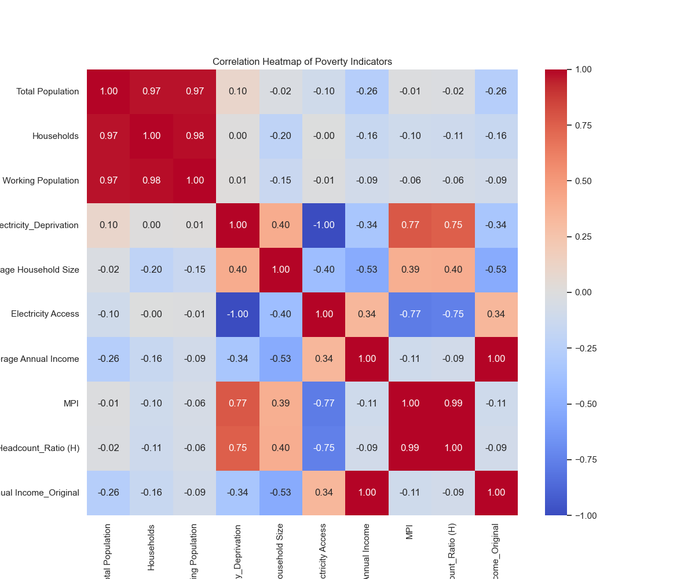
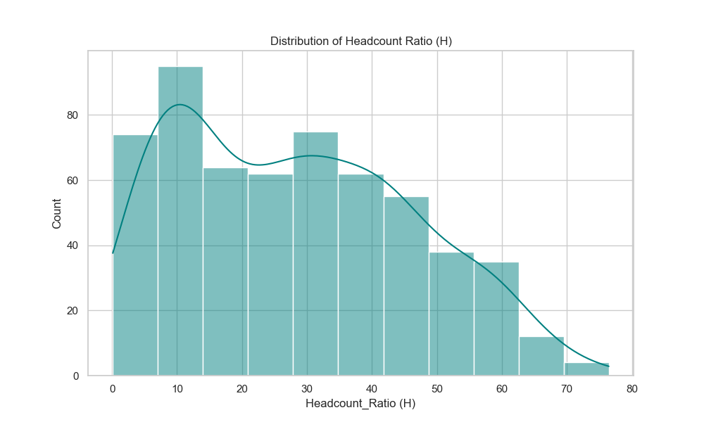
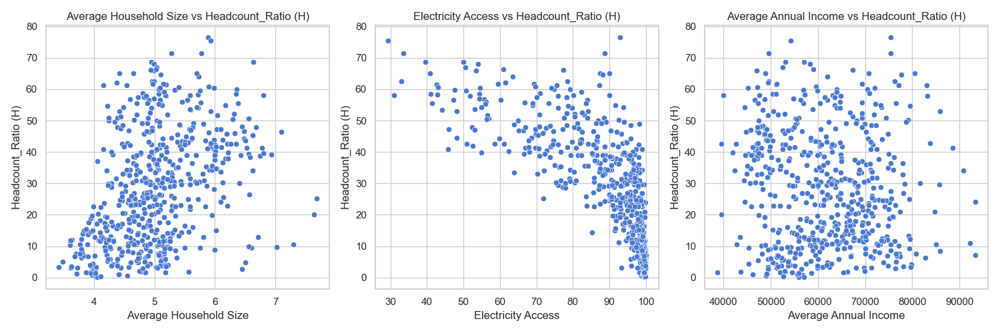
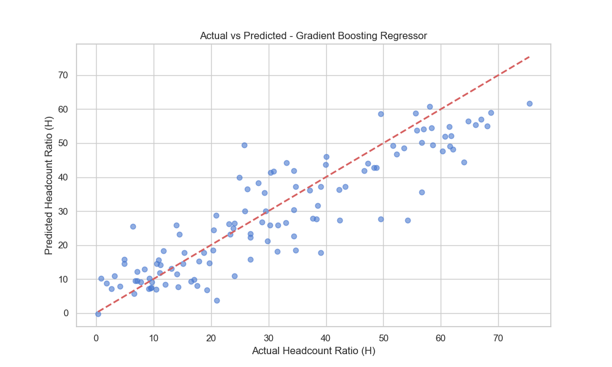
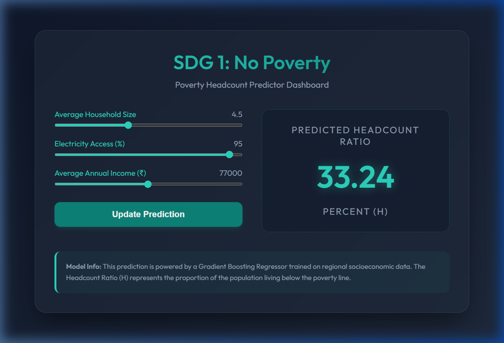

# Poverty Headcount Predictor – SDG 1: No Poverty

## Project Overview
This project is a Machine Learning mini-project focused on predicting the **Poverty Headcount Ratio (H)** using socioeconomic indicators. It aligns with the United Nations Sustainable Development Goal 1: **No Poverty**.

The model uses data-driven insights to understand how factors like household size, electricity access, and annual income influence poverty levels across different regions.

## Dataset
The project uses the `integrated_poverty_dataset.csv` dataset, which contains the following columns:
- **State** & **District**: Regional identifiers.
- **Total Population** & **Households**: Demographic scale.
- **Total Working Population**: Economic activity indicator.
- **Electricity_Deprivation** & **Electricity Access**: Infrastructure indicators.
- **Average Household Size**: Social indicator.
- **Average Annual Income**: Economic indicator.
- **MPI**: Multidimensional Poverty Index.
- **Headcount_Ratio (H)**: The target variable for prediction.

## Features Used for Prediction
1. **Average Household Size**
2. **Electricity Access**
3. **Average Annual Income**

## Implementation Logic
1. **Data Cleaning**: Handled missing values and stripped whitespace from column names.
2. **Outlier Handling**: Used the IQR method to detect outliers in `Average Annual Income` and applied **Winsorization** (clipping) to stabilize the data.
3. **Exploratory Data Analysis (EDA)**:
   - Correlation analysis to identify feature importance.
   - Distribution analysis of the target variable.
   - Visualization of feature-target relationships.
4. **Model Training**: Compared three regression models:
   - Linear Regression
   - Random Forest Regressor
   - Gradient Boosting Regressor
5. **Evaluation**: Used MAE, MSE, RMSE, and R² score to compare performance.

## Visualizations

### 1. Outlier Handling (Average Annual Income)
Comparison of income distribution before and after IQR-based Winsorization.


### 2. Correlation Heatmap
Understanding the relationship between various socioeconomic indicators.


### 3. Headcount Ratio Distribution
Analyzing the spread of the target variable `Headcount_Ratio (H)`.


### 4. Feature Relationships
Scatter plots showing how individual features correlate with the Headcount Ratio.


### 5. Model Performance (Actual vs Predicted)
Visualizing the prediction accuracy of the best-performing model (Gradient Boosting Regressor).


### 6. Feature Importance
Identifying which factors contribute most to the poverty headcount prediction.
### 7. Interactive Dashboard
A modern web interface allowing real-time predictions based on user-adjusted socioeconomic factors.


## Model Results
| Model | MAE | MSE | RMSE | R² Score |
| :--- | :--- | :--- | :--- | :--- |
| Linear Regression | 8.3651 | 112.5517 | 10.6090 | 0.7073 |
| Random Forest Regressor | 8.6534 | 118.7246 | 10.8961 | 0.6912 |
| **Gradient Boosting Regressor** | **7.3242** | **82.6212** | **9.0896** | **0.7851** |

### Interpretation
The **Gradient Boosting Regressor** is the best model for this task, explaining approximately **78.51%** of the variance in the poverty headcount ratio. **Electricity Access** and **Average Annual Income** are the strongest predictors.

## How to Run
1. Ensure you have the required libraries installed:
   ```bash
   pip install pandas numpy matplotlib seaborn scikit-learn scipy
   ```
2. Run the script:
   ```bash
   python poverty_predictor.py
   ```

## Author
*ML Mini Project - Poverty Headcount Predictor*
